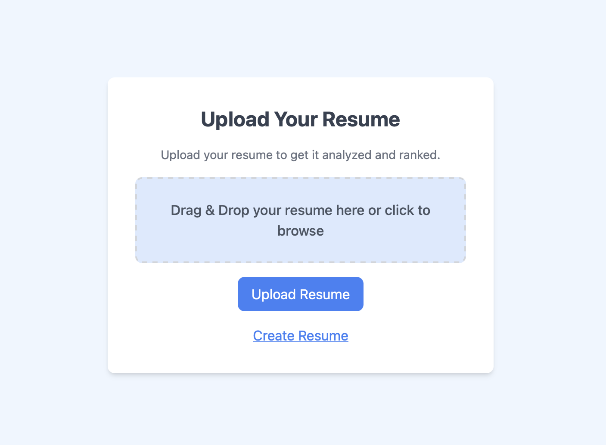
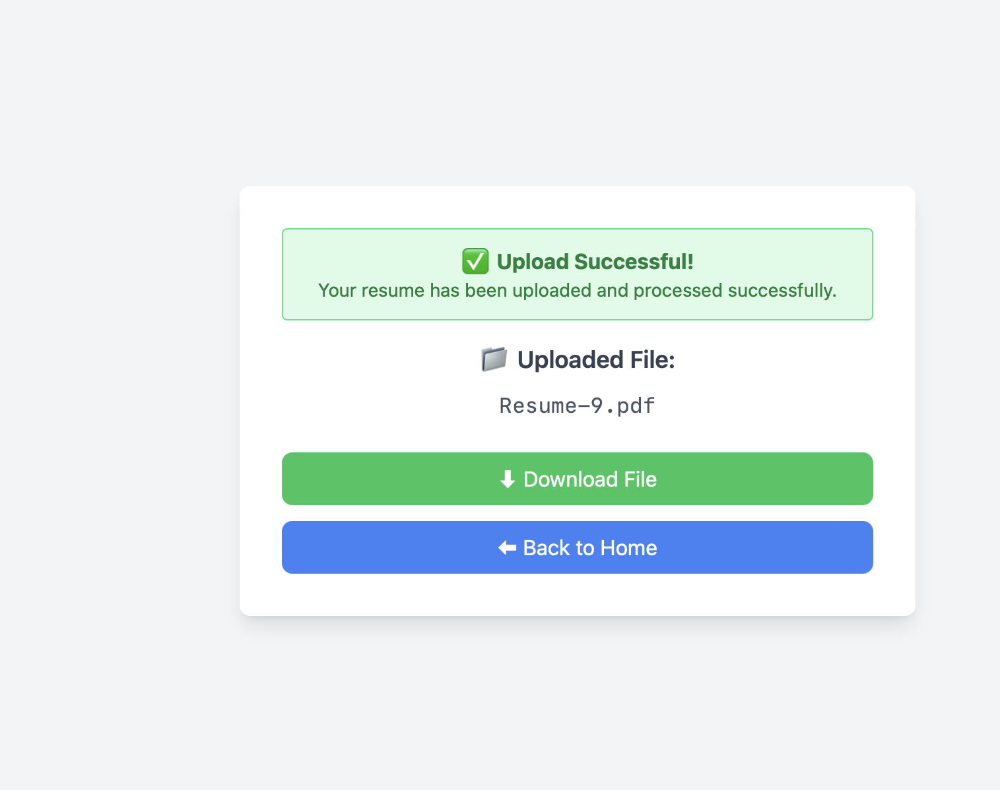
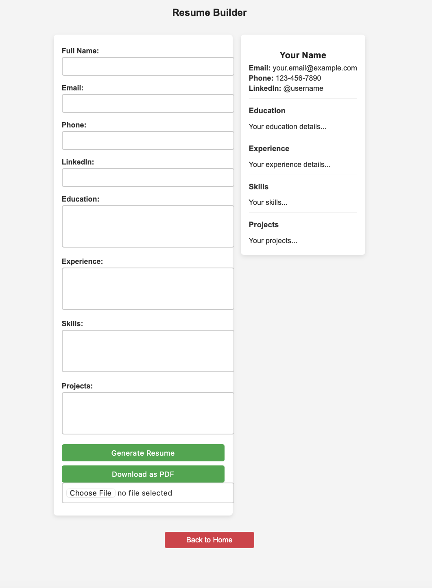
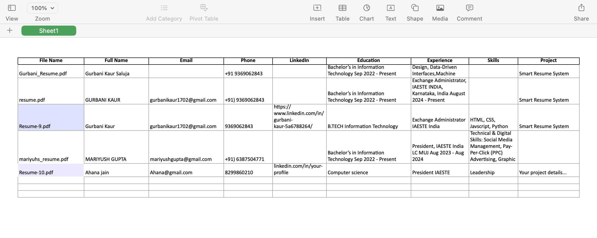
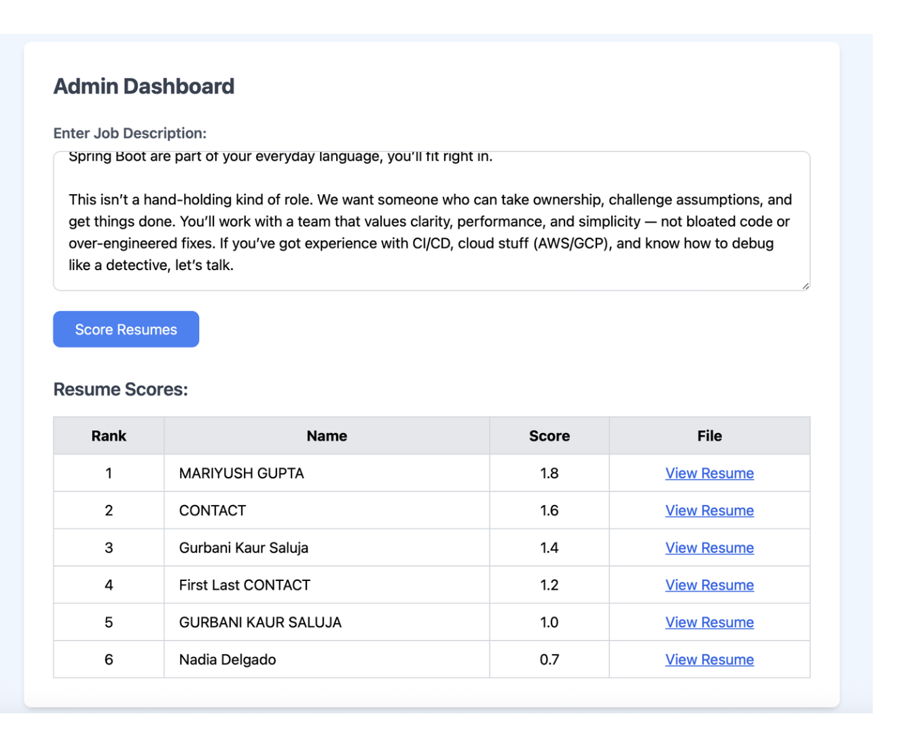
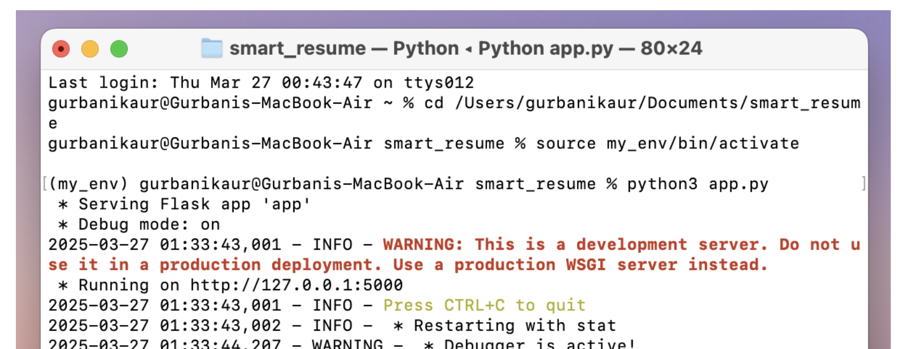

# 📄 Smart Resume System

An intelligent resume parsing and classification platform that automates resume processing and improves recruiter efficiency by up to 40%.

> 🔍 Built using Python, JavaScript, SQL/NoSQL, and Excel Automation  
> 🎯 Developed as part of an academic project to showcase product thinking and automation capability

---

## 📚 Table of Contents

- [Features](#features)
- [Tech Stack](#tech-stack)
- [Screenshots](#screenshots)
- [File Structure](#file-structure)
- [How to Run Locally](#how-to-run-locally)
- [Documentation](#documentation)
- [License](#license)
- [Contributing](#contributing)
- [Author](#author)

---

## 🚀 Features

- 📤 Upload and parse resumes (PDFs)
- 🧠 Extract and structure resume data using Python
- 📊 Store data using SQL/NoSQL databases
- 📈 Excel-based automation for fast filtering/sorting
- 📎 Clear documentation with user-friendly flow

---

## 🛠️ Tech Stack

- **Backend**: Python  
- **Database**: SQL / NoSQL  
- **Frontend**: HTML, CSS, JavaScript  
- **Tools**: Excel Automation, Git, GitHub

---

## 🖼 Screenshots

### 🔹 Upload Interface


### 🔹 Upload Success Message


### 🔹 Resume Builder Page


### 🔹 Parsed Output Table


### 🔹 Parsed Output Table (Alternative View)


### 🔹 Terminal Code Run


---

## 📂 File Structure

```bash
Smart-Resume-System/
├── src/
│   └── [Python scripts and logic]
├── assets/
│   ├── upload_ui.png
│   ├── upload_success.png
│   ├── resume_builder.png
│   ├── output_table.png
│   ├── output_table2.png
│   └── coderun.png
├── docs/
│   └── Smart-Resume-System-Presentation.pdf
├── requirements.txt
├── README.md
└── LICENSE

---

## How to Run Locally

1. Clone the repository:
git clone https://github.com/KaurGurbani/Smart-Resume-System.git
cd Smart-Resume-System

2. Install dependencies:
pip install -r requirements.txt

3. Run the Python script:
python src/resume_parser.py

---

## 🗂 Documentation

📄 Smart Resume System – Minor Project Presentation (PDF)

---

## 📄 License

This project is licensed under the MIT License.

---

## 🤝 Contributing

Pull requests are welcome! For major changes, please open an issue first to discuss what you'd like to change.

---

## 👩‍💻 Author

Gurbani Kaur
📧 gurbanikaur1702@gmail.com
🔗 LinkedIn
🧑‍💻 GitHub

---
